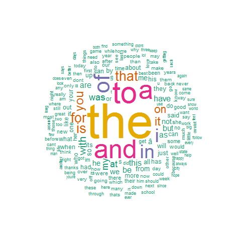

#### Objective
This report is a part of course work for Data-Science Specialization provided by Johns hopkins Universty at Coursera.  
The goal of this project is to create a Shiny app that will predict the next word after the user inputs  words   
This document will give an overview to features of the data used for this
project and briefly summarize plans for creating the prediction algorithm  

#### Downloading and loading the data

Download the data from the Coursera site https://d396qusza40orc.cloudfront.net/dsscapstone/dataset/Coursera-SwiftKey.zip  
The data is from a corpus called HC Corpora http://www.corpora.heliohost.org   
See the readme file at http://www.corpora.heliohost.org/aboutcorpus.html for details on the corpora available.  
The data is available in four locales en_US, de_DE, ru_RU and fi_FI, for this exercise only en_US is used.  
Further each language folder has three text documents extracted from news, blogs and twitter

The code to download the data in R
```{r eval=FALSE}
if (!file.exists("Coursera-SwiftKey.zip")){
  download.file("https://d396qusza40orc.cloudfront.net/dsscapstone/dataset/Coursera-SwiftKey.zip", "Coursera-SwiftKey.zip")
  unzip("Coursera-SwiftKey.zip")
}
```


Loading the document in R
  
  
```{r cache=TRUE,warning=FALSE, message=FALSE}

con<-file('en_US/en_US.blogs.txt','r')
blogs<-readLines(con)
close(con)

con<-file('en_US/en_US.news.txt','rb')
news<-readLines(con)
close(con)

con<-file('en_US/en_US.twitter.txt','r')
twitter<-readLines(con)
close(con)

```

#### Data Statistics
Getting more information regarding the documents loaded like the size, number of lines, characters and count  
```{r warning=FALSE}
library(NLP)
library(tm)
library(RWeka)
library(stringi)
library(SnowballC)
library(plyr)
library(data.table)
```

```{r cache=TRUE,warning=FALSE, message=FALSE}
sizeBlogs<-file.info('en_US/en_US.blogs.txt')$size/1024^2 ## size
linesBlogs<-length(blogs) ##lines
charsBlogs<-sum(nchar(blogs)) ## no of characters
wordsBlogs<-sum(stri_count_words(blogs))

sizeNews<-file.info('en_US/en_US.news.txt')$size/1024^2 ## size
linesNews<-length(news) ##lines
charsNews<-sum(nchar(news)) ## no of characters
wordsNews<-sum(stri_count_words(news))

sizeTwitter<-file.info('en_US/en_US.twitter.txt')$size/1024^2 ## size
linesTwitter<-length(twitter) ##lines
charsTwitter<-sum(nchar(twitter)) ## no of characters
wordsTwitter<-sum(stri_count_words(twitter))

infoTable<-data.frame(TextType=c("blogs",'news','twitter'),
                      Size_MB=c(sizeBlogs,sizeNews,sizeTwitter),
                      NoOfLines=c(linesBlogs,linesNews,linesTwitter),
                      NoOfChars=c(charsBlogs,charsNews,charsTwitter),
                      NoOfWords=c(wordsBlogs,wordsNews,wordsTwitter))
infoTable
```

####Data Pre-Processing
Pre-Processing the data to remove punctuation, digit, whitespace adn tranform all the characters to lower case
```{r cache=TRUE,warning=FALSE, message=FALSE, eval=FALSE}
blogsProcessed<- gsub('[[:punct:]]+','',blogs)
newsProcessed<- gsub('[[:punct:]]+','',news)
twitterProcessed<- gsub('[[:punct:]]+','',twitter)

blogsProcessed<- gsub('[[:digit:]]+','',blogsProcessed)
newsProcessed<- gsub('[[:digit:]]+','',newsProcessed)
twitterProcessed<- gsub('[[:digit:]]+','',twitterProcessed)

blogsProcessed <- tolower(blogsProcessed)
newsProcessed  <-  tolower(newsProcessed)
twitterProcessed  <-  tolower(twitterProcessed)

blogsProcessed<-stripWhitespace(blogsProcessed)
newsProcessed<-stripWhitespace(newsProcessed)
twitterProcessed<-stripWhitespace(twitterProcessed)
```

After the all the files are processed KfNgram.exe was used to generate the ngrams   
you can know more about it from [here](http://www.kwicfinder.com/kfNgram/kfNgramHelp.html)   
Alternative to this was using package tm  
Unigram, Bigram and Trigram were made using kFNgram for each of the processed data.  
 
The ngram files from each blogs, news and twitter were combined and aggregated to form only one file sorted with descending order of the frequency of occurance of that word  

#### WordClouds

##### Unigrams  
"the" is the most frquent word from the text


##### Bigrams
"in the" and "of the" are the most frquent bigram from the text


##### Trigrams
"one of the" is the most frequent trigram from the text


#### Further Analysis
1. For Further analysis the only 65% of text from blogs, 
twitter and news 
will be considered while the rest will be used as 
test data  
2. Profane words will be removed by using the list 
provided by ShutterShock so as to avoid predicting 
them  
3. Markov's model will be looked into
4. Stopwords were not removed 

#### Appendix
This section excerpts the code for ngram handling and creating the wordcloud

```{r eval=FALSE}
blogsUnigram <- read.table("blogsProcessed.txt-01-ngrams-Freq.txt",sep="\t")
newsUnigram <- read.table("newsProcessed.txt-01-ngrams-Freq.txt",sep="\t")
twitterUnigram <- read.table("twitterProcessed.txt-01-ngrams-Freq.txt",sep="\t")
Unigram <- rbind(blogsUnigram, newsUnigram, twitterUnigram)
UnigramSum <- aggregate(V2~V1, data=Unigram, sum)
UnigramSort <- arrange(UnigramSum, desc(V2))
##WordCloud
pal <- brewer.pal(6,"Dark2")
wordcloud(UnigramSort$V1, UnigramSort$V2,c(8,.6),max.words=200,random.order=F,rot.per=0.15, colors=pal,use.r.layout=FALSE)
```


for Bigrams

```{r eval= FALSE}
newsBigram <- read.table("newsProcessed.txt-02-ngrams-Freq.txt", sep ="\t")
blogsBigram <- read.table("blogsProcessed.txt-02-ngrams-Freq.txt", sep ="\t")
twitterBigram <- read.table("twitterProcessed.txt-02-ngrams-Freq.txt", sep ="\t")
Bigram <- rbind(blogsBigram,newsBigram,twitterBigram)
BigramSum <- aggregate(V2~V1, data=Bigram, sum)
BigramSort <- arrange(BigramSum, desc(V2))
wordcloud(BigramSort$V1, BigramSort$V2,c(8,.3),max.words=100,random.order=F,rot.per=0.15, colors=pal,use.r.layout=FALSE)
```

For Trigrams

```{r eval=FALSE}

blogsTrigram <- read.table("blogsProcessed.txt-03-ngrams-Freq.txt", sep ="\t")
newsTrigram <- read.table("newsProcessed.txt-03-ngrams-Freq.txt", sep ="\t")
twitterTrigram <- read.table("twitterProcessed.txt-03-ngrams-Freq.txt", sep ="\t")
Trigram <- rbind(blogsTrigram,newsTrigram,twitterTrigram)
TrigramSum <- aggregate(V2~V1, data=Trigram, sum)
TrigramSOrt <- arrange(TrigramSum, desc(V2))

wordcloud(TrigramSOrt$V1, TrigramSOrt$V2,c(4,.2),max.words=100,random.order=F,rot.per=0.15, colors=pal,use.r.layout=FALSE)
```

blogsQuadgram <- read.table("blogsProcessed.txt-04-ngrams-Freq.txt", sep ="\t")
newsQuadgram <- read.table("newsProcessed.txt-04-ngrams-Freq.txt", sep ="\t")
twitterQuadgram <- read.table("twitterProcessed.txt-04-ngrams-Freq.txt", sep ="\t")


Splitting n-gram columns into many 
BigramSplitted <- data.frame(do.call('rbind', strsplit(as.character(BigramSort$V1),' ',fixed=TRUE)))
BigramSplitted <- cbind(BigramSplitted,BigramSort$V2)


TrigramSplitted <- data.frame(do.call('rbind', strsplit(as.character(TrigramSort$V1),' ',fixed=TRUE)))
TrigramSplitted <- cbind(TrigramSplitted,TrigramSort$V2)
write.csv(TrigramSplitted,"TrigramSplitted.csv")
Quadgram <- rbind(blogsQuadgram,newsQuadgram,twitterQuadgram)
QuadgramSum <- aggregate(V2~V1, data=Quadgram, sum)
QuadgramSort <- arrange(QuadgramSum, desc(V2))
write.csv(QuadgramSort,"QuadgramSort.csv")

QuadgramSplitted <- data.frame(do.call('rbind', strsplit(as.character(QuadgramSort$V1),' ',fixed=TRUE)))
QuadgramSplitted <- cbind(QuadgramSplitted,QuadgramSort$V2)
write.csv(QuadgramSplitted,"QuadgramSplitted.csv")

BigramDT <- data.table(BigramSplitted, keys = c(BigramSplitted$X1, BigramSplitted$X2))
TrigramDT <- data.table(TrigramSplitted, keys = c(TrigramSplitted$X1, TrigramSplitted$X2,TrigramSplitted$X3))
QuadgramDT <- data.table(QuadgramSplitted,keys = c(QuadgramSplitted$X1,QuadgramSplitted$X2,QuadgramSplitted$X3,QuadgramSplitted$X4))

save.image("D:/nidhim/Data Science/Capstone Project/July-August/SplittedRdata.RData")


